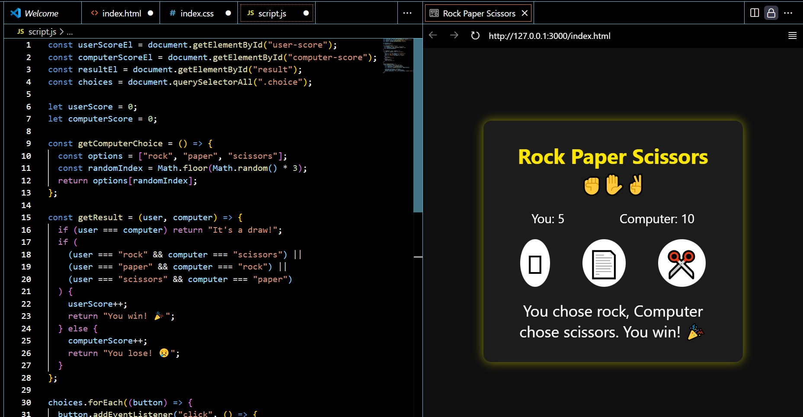

# ✊ Rock Paper Scissors Game

A fun and interactive Rock Paper Scissors game built using **HTML**, **CSS**, and **JavaScript** where you can play against the computer. 🖥️✨

## 🎮 How It Works

- Choose Rock, Paper, or Scissors by clicking one of the icons.
- The computer randomly selects its choice.
- The result (Win/Lose/Draw) is instantly displayed.
- Scores are tracked for both the player and the computer.

## 🛠️ Tech Stack

- **HTML** – Structure
- **CSS** – Styling and Layout
- **JavaScript** – Game logic and interactivity

## 📸 Screenshot

